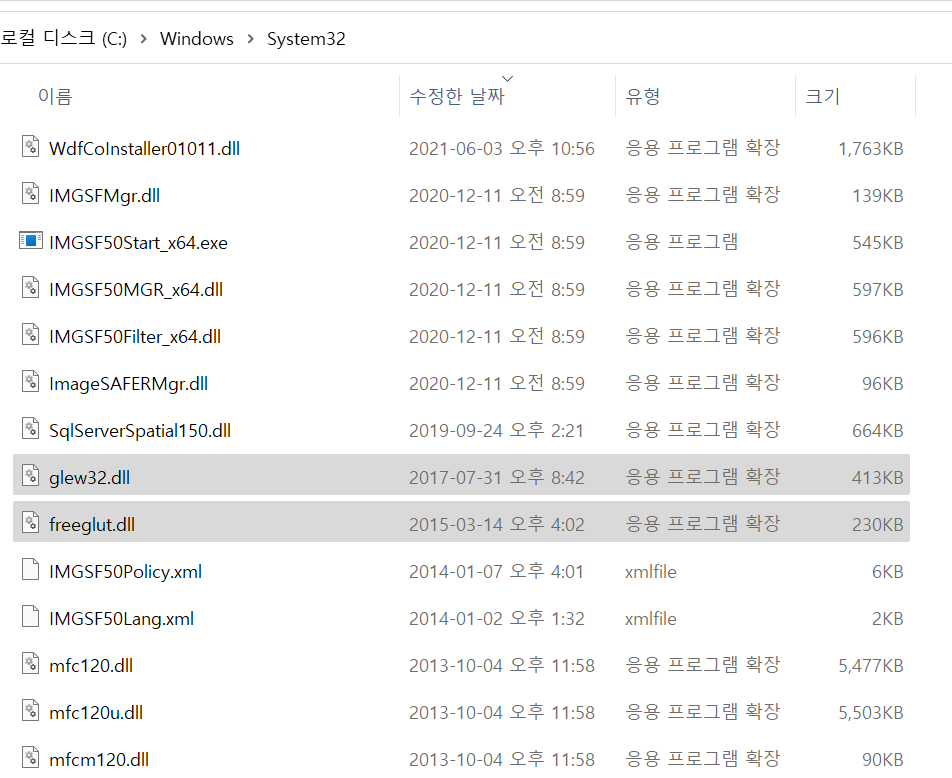
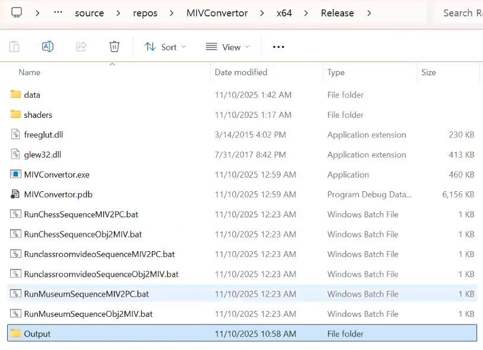
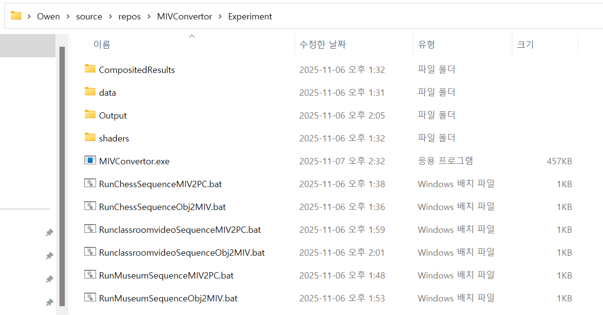
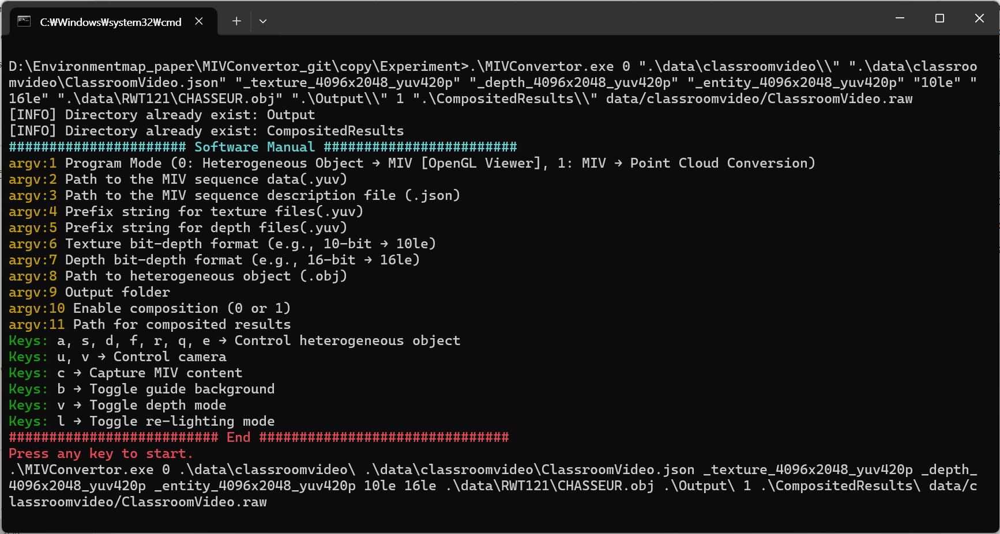
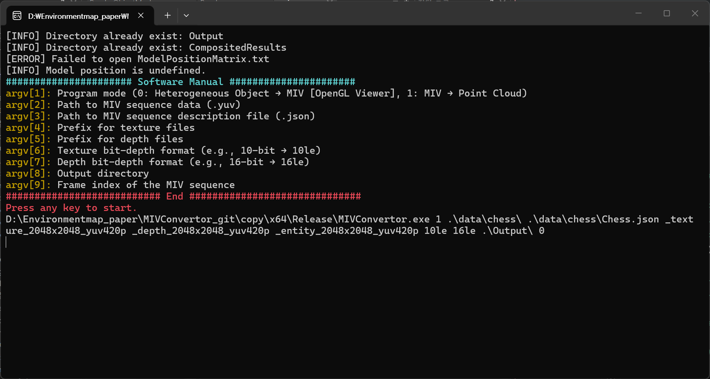

# MIVConvertor

MIV Converter is a conversion software designed to comply with the MIV Standard v2 for representing heterogeneous objects.
Its main features include heterogeneous object embedding—particularly geometric information processing of heterogeneous object models—and MIV conversion of point cloud models

## Development Environment

This software is developed in **C++17** using the **Visual Studio 2022** Windows development environment.  
It relies on **OpenGL** library functions for rendering and visualization.

---

### Required Tools

To build and run this software, make sure the following tools and libraries are installed:

- **Visual Studio**
- **[OpenGL](https://www.opengl.org/)**
- **[GLEW](http://glew.sourceforge.net/)**
- **[FreeGLUT](http://freeglut.sourceforge.net/)**
- **[GLM](https://github.com/g-truc/glm)**
---

### Notes

- Ensure that the **OpenGL**, **GLEW**, **GLM** and **FreeGLUT** libraries are correctly linked in your Visual Studio project.  


# OpenGL Installation 

This guide explains how to install **OpenGL** along with the **FreeGLUT** and **GLEW** libraries required for the project.

We have included the OpenGL library we are using in glinstall folder.  
Alternatively, you can install OpenGL manually.


## Installation Steps

## File Paths

This section provides the default file paths for the OpenGL libraries required for the project.

---

### 1. Header File Path

C:\Program Files (x86)\Windows Kits\10\Include\xx.x.xxxxx.x\um\gl

### 2. DLL and Lib File Path

C:\Program Files (x86)\Windows Kits\10\Lib\xx.x.xxxxx.x\um\x64

The locations of the .dll files required for OpenGL installation are shown in the image. They can be placed in a local folder or copied to the system folder. 

**C:\Windows\System32**



**.\Experiment\**




---

# Building the Project
After opening the configured `.sln` file in Visual Studio, build the project to generate the executable file.

# Project Structure
The software package includes the following key components:
- **MIVconverter** – Source code for the main application  
- **experiment** – Experimental scripts and utilities for testing and evaluation  
- **data** – Contains the datasets required by the software, including original MIV image frames such as chess, classroomvideo, and museum. In addition to the data, the folder also includes the GLSL global parameter files imageProcessingUniform.csv and parameters_hetro.csv, as well as brdfIntegrationMap.pfm, for ambient-light image processing and object–ambient-light interaction. 



## Dataset and 3D Model Resources

The datasets required by this software are based on the MIV standard and can be downloaded from:

- Public MIV datasets: [MPEG Content Database](https://mpeg-miv.org/index.php/content-database-2/)  
- Restricted datasets (e.g., *museum*, *loot*, *redandblack*, *longdress*): available with permission from the [MPEG Expert Group](https://mpegfs.int-evry.fr/)  
- 3D models (.obj) for heterogeneous objects: [Textured Mesh Repository](https://texturedmesh.isti.cnr.it/download)


## Environment Light Rendering Support (Optional)

To enable environment light rendering, the software includes several `.csv` files in the `data` folder that define GLSL uniform parameters.  
These parameters support GLSL-based image processing techniques, such as importance sampling.

As part of the MIV standard, the software uses the renderer included in the MIV reference implementation to generate environment maps.  
Preprocessed environment light images are stored in the `dataset` folder, sharing filenames with the corresponding `.json` files but using the `.yuv` extension.


## Software manual

### Heterogeneous object to MIV


After configuring the experimental files, run the program. The program operates in two modes. When the mode code is set to zero, a simple OpenGL rendering window is launched, displaying the MIV image rendered by the current camera along with the foreign object. The program provides basic keyboard controls that allow the user to move the foreign object within the MIV space. Once the object is positioned satisfactorily, it can be automatically captured by pressing the 'c' key. During automatic capture, the OpenGL window will automatically switch between cameras to record images of the object from multiple angles, collecting both texture and geometric information. Each automatic capture cycle corresponds to one frame, and the program will close automatically upon completion.
If the user wishes to composite the captured image with the original frame, the auto composition parameter can be set to 1 in the execution parameters. The composited MIV data will then be saved in the compositionResult folder.


### MIV to Point cloud


With the widespread use of point cloud data, this program also provides MIV transformation functionality for point cloud datasets. Setting the mode code to 1 in the parameters enables the program to read the original MIV data and perform point cloud reconstruction. Unlike mode code 0, this mode does not launch an OpenGL window for scene rendering or composition. Therefore, only the output path (the Output folder) needs to be specified in the parameters, and the composited results folder (CompositedResults folder) does not need to be defined.


## Example
The .bat files serve as example scripts for running the software, providing users with pre-configured program parameters. Users can easily run the program’s default functions by simply double-clicking the executable .bat file in the local folder.

### Heterogeneous object to MIV example
```
.\MIVConvertor.exe 0 ".\data\classroomvideo\\" ".\data\classroomvideo\ClassroomVideo.json" "_texture_4096x2048_yuv420p" "_depth_4096x2048_yuv420p" "_entity_4096x2048_yuv420p" "10le" "16le" ".\data\RWT121\CHASSEUR.obj" ".\Output\\" 0 ".\CompositedResults\\"
```

### MIV to Point cloud example
```
.\MIVConvertor.exe 1 ".\data\chess\\" ".\data\chess\Chess.json" "_texture_2048x2048_yuv420p" "_depth_2048x2048_yuv420p" "_entity_2048x2048_yuv420p" "10le" "16le" ".\Output\\"
```